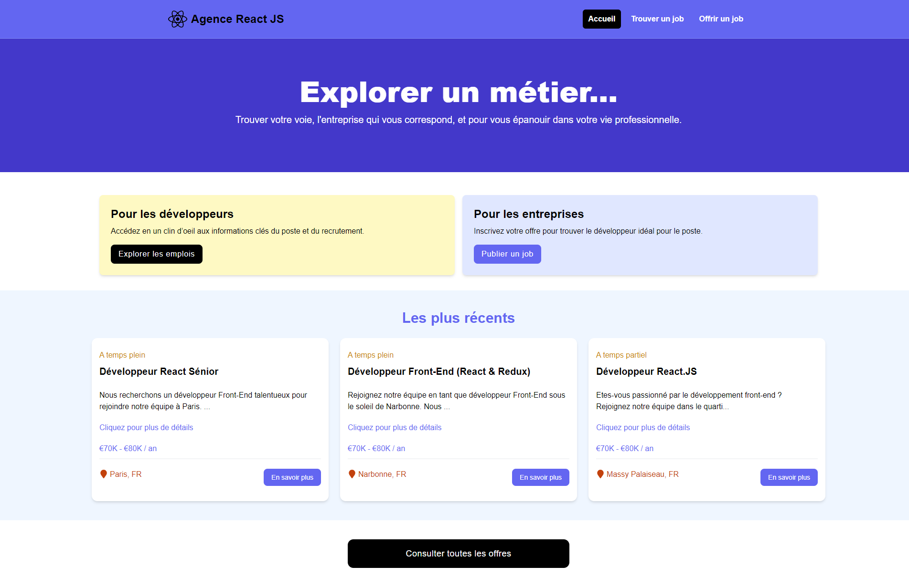

# Agence REACT.JS

Il s'agit de la création d'une agence d'Interim qui liste ses offres d'emploi en REACT.  
Le projet est construit à partir de <strong> Vite </strong> et <strong> React.Js </strong>. On utilise <strong> Json-Server </strong> en backend.

##

## Installation des dépendances

- npm install
- npm run dev
